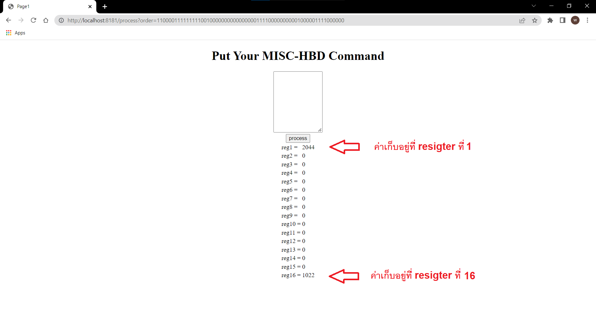

# Exit Exam 2/64
## ภาษาที่ใช้  Java v11 สร้างด้วย Spring Boot v2.6.5

## Libraries ที่ใช้เพิ่มเติมคือ Spring web และ Thymeleaf

## 1. MVC Model แบ่งเป็น

## 1.1 Model
### &emsp; ประกอบด้วย file ชื่อ Register ซึ่งใช้เป็น model ในการส่งข้อมูล register ทั้งหมด 16 ตัวระหว่าง view และ control
## 1.2 View
### &emsp; ประกอบด้วย file ชื่อ index.html ทำหน้าที่เป็น UI สำหรับติดต่อกับผู้ใช้
## 1.3 Controller
### &emsp; ประกอบด้วย file ชื่อ MainController และ Service
#### &emsp;&emsp; - MainController ทำหน้าที่รับและตอบกลับ Request ต่างๆ ของ User และยังทำหน้าที่ส่งข้อมูลสำคัญที่ต้องการประมวลผลไปยัง service อื่นๆ 
#### &emsp;&emsp; - Service ทำหน้าที่จำลองการทำงานของ MISC-HBD
###

## 2. ตัวอย่างการทำงานของโปรแกรม

### ภาพที่ 1 ข้อมูลที่แสดงบน ui 

### ภาพที่ 2 ข้อมูลที่แสดงบน ui หลังจากกดปุ่ม process

### ปล. Main Program อยู่ที่ file ชื่อ Mvc1Application และ เปิดหน้า Web ด้วย localhost port 8181

